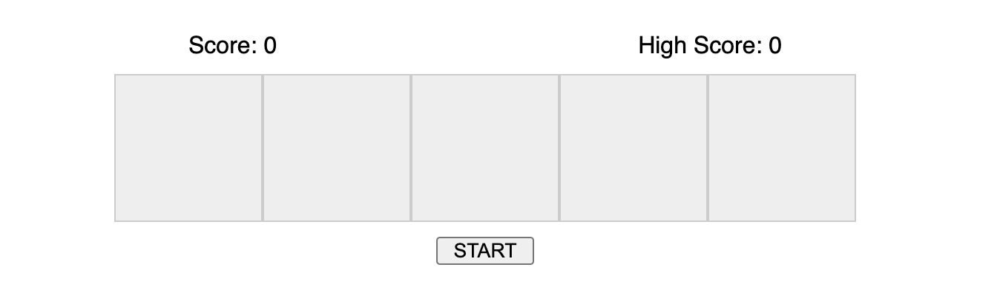

# Challenge 06: Memory Game

# 요구사항

* [Memory Game](https://github.com/Chocobe/-Study-dom-challenge/tree/master/06-memory-game)
* 고정된 블록 개수로 Memory Game 만들기 (블록 개수 설정 가능)
* ``START`` 버튼으로 게임 시작하기
* 블록은 순차대로 깜빡거리며, 1개 부터 시작
* 블록은 랜덤으로 깜빡여야 하고, 같은 블록은 2번까지만 연속되어야 함
* 사용자는 동일한 순서로 블록을 클릭하기
* 사용자가 정확하게 클릭 했다면, 개수가 증가된 다음 레벨로 넘어간다.
* 틀렸다면, 틀린 블록을 표시해 준다.
* 현재 게임 점수를 유지한다.

 
 

# 보너스

* High Score 기록 하기
* High Score 는 LocalStorage 에 저장하기

 
 

# 데모

 
 
 